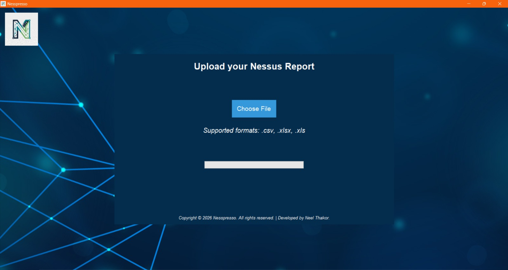
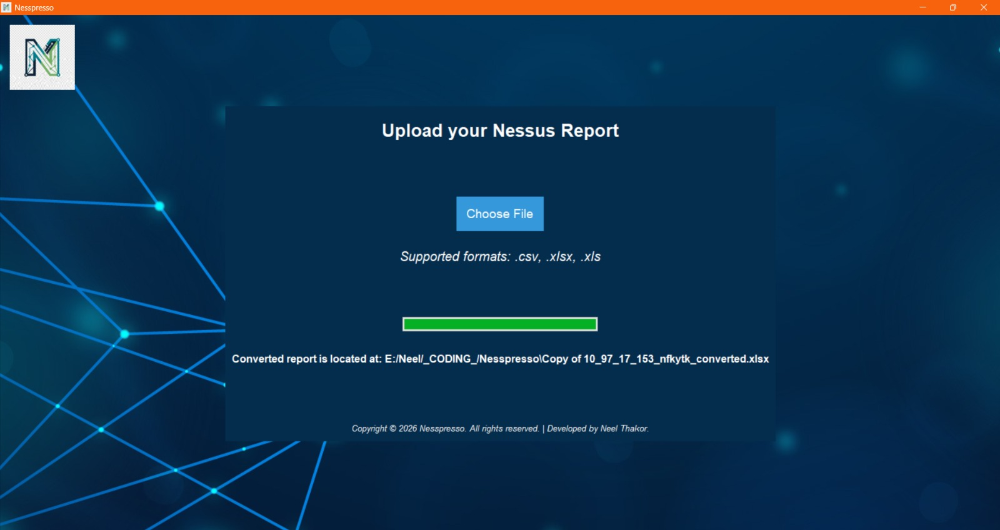

<p align="center">
  
</p>

<h1 align="center">Nesspresso</h1>

<p align="center">
  Data Processing & Reporting Automation for Nessus Reports
</p>
---


## Overview

Nesspresso is a Python-based data processing and reporting automation tool specifically designed for Nessus vulnerability assessment reports. Large Nessus scan exports often contain thousands of records representing the same vulnerability across multiple hosts, ports, or services, making analysis difficult and time-consuming. Nesspresso automatically correlates and consolidates related findings into unified, analysis-ready entries, improving report readability while typically reducing dataset size by 80–90%.

---

## Key Features

* Automated data cleaning and transformation
* Aggregation and consolidation of related findings
* Intelligent correlation of vulnerabilities across hosts and services
* Professional Excel report generation
* Automated cover page creation and report formatting
* Significant reduction in report size and analysis effort
* Improved readability and prioritization of findings
* Features a two-tier authentication mechanism requiring both a pre-registered device MAC address and user password verification for secure application access.

---

## Example Results

| Original Dataset | Processed Report | Reduction |
| ---------------- | ---------------- | --------- |
| 221 Records      | 27 Findings      | 87.8%     |
| 2785 Records     | 367 Findings     | 86.8%     |

> Dataset reduction varies depending on scan characteristics, but Nesspresso typically reduces report size by **80–90%** while preserving critical information.

---

## Technology Stack

* Python
* Pandas
* Tkinter
* OpenPyXL
* Pillow

---

## Processing Workflow

```text
Raw Nessus CSV Export
          ↓
Data Cleaning
          ↓
Record Correlation
          ↓
Finding Consolidation
          ↓
Report Generation
          ↓
Excel Deliverable
```

---

## Project Structure

Nesspresso/
├── src/
│   ├── __init__.py
│   ├── backend.py
│   ├── frontend.py
│   └── login.py
│
├── docs/
│   ├── logo/
│   │   ├── app_logo.png
│   │   ├── bgi1.jpg
│   │   └── logo.ico
│   │
│   ├── reports/
│   │   ├── Nesspresso_Report.xlsx
│   │   └── Nessus_Report.csv
│   │
│   └── screenshots/
│       ├── homePage.png
│       └── output.png
│
├── requirements.txt
├── README.md
├── LICENSE
└── .gitignore

---

## Why Nesspresso?

Traditional Nessus exports can become difficult to analyze due to the large number of related findings generated across multiple assets. Nesspresso transforms these verbose datasets into concise, structured reports that help analysts focus on meaningful information rather than repetitive records.

---

## Screenshots

### Application Interface



### Output



---

## Future Enhancements

* Interactive analytics dashboard
* Advanced report templates
* Additional export formats
* Enhanced correlation logic
* Executive summary generation

---

## Author

**Neel Thakor**
